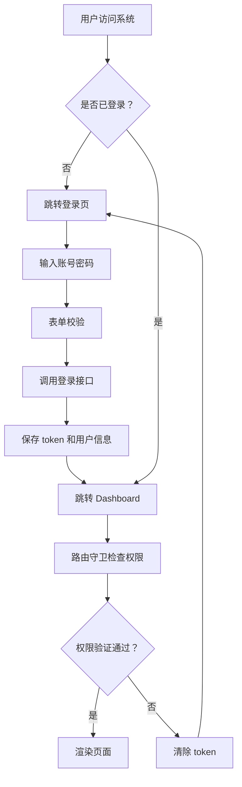

# Vue3 企业级前端管理后台 PRD

## 1. 产品概述

基于 Vue3 + TypeScript + Vite 构建的企业级前端管理后台，提供用户登录鉴权、动态菜单权限控制、仪表盘展示等核心功能。

- 解决目标：提供一套开箱即用的企业级前端架构方案
- 目标用户：企业后台管理人员、系统运维人员

## 2. 核心功能

### 2.1 用户角色

| 角色 | 登录方式 | 核心权限 |
|------|----------|----------|
| 管理员 | 账号密码/单点登录 | 全量菜单访问、系统管理 |
| 普通用户 | 账号密码/单点登录 | 受限菜单访问、基础操作 |

### 2.2 功能模块

1. **登录页**：账号密码登录、表单校验、loading 状态、单点登录回调
2. **控制台 Dashboard**：布局框架（Header + Sidebar + Main）、面包屑导航、用户信息、动态菜单
3. **权限控制**：路由级鉴权、菜单权限过滤、按钮级权限指令

### 2.3 页面详情

| 页面名称 | 模块名称 | 功能描述 |
|----------|----------|----------|
| 登录页 | 登录表单 | 账号密码输入、表单校验、登录按钮、loading 状态 |
| 登录页 | 单点登录回调 | 接收 SSO 票据、自动登录、错误处理 |
| Dashboard | Header | 面包屑导航、用户信息展示、退出登录 |
| Dashboard | Sidebar | 动态菜单渲染、权限过滤、激活状态 |
| Dashboard | Main | 路由出口、页面内容渲染 |

## 3. 核心流程

### 3.1 登录流程

用户访问系统 → 检查登录状态 → 未登录跳转登录页 → 输入账号密码 → 表单校验 → 调用登录接口 → 保存 token 和用户信息 → 跳转 Dashboard

### 3.2 权限验证流程

用户访问页面 → 路由守卫检查 → 验证 token 有效性 → 获取用户权限 → 动态生成菜单和路由 → 允许访问/拒绝访问

## 4. 用户界面设计

### 4.1 设计风格

- 主色调：#409EFF（Element Plus 默认蓝）
- 辅助色：#67C23A（成功绿）、#E6A23C（警告橙）、#F56C6C（错误红）
- 按钮风格：圆角按钮，主要/次要/危险分级
- 字体：系统默认字体，14px 基础字号
- 布局：左侧固定侧边栏 + 顶部 Header + 主内容区
- 图标：使用 Element Plus 图标

### 4.2 页面设计

| 页面名称 | 模块名称 | UI 元素 |
|----------|----------|---------|
| 登录页 | 登录表单 | 居中卡片、账号密码输入框、记住我、登录按钮 |
| Dashboard | Header | Logo、面包屑、用户名、退出按钮 |
| Dashboard | Sidebar | 可折叠菜单、图标 + 文字、激活高亮 |
| Dashboard | Main | 白色背景卡片、面包屑下方内容区 |

### 4.3 响应式

- 桌面端优先，侧边栏可折叠
- 移动端自适应，侧边栏改为抽屉式
- 触摸优化，按钮大小适配移动端