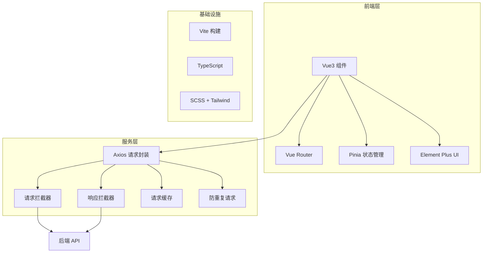
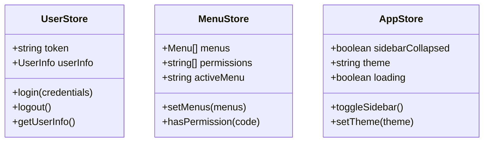

# Vue3 企业级前端管理后台 技术架构

## 1. 架构设计



## 2. 技术说明

- 前端：Vue3 + TypeScript + Vite
- 状态管理：Pinia
- 路由：Vue Router 4
- UI 组件库：Element Plus
- CSS 方案：SCSS + Tailwind CSS
- 请求库：Axios
- 构建工具：Vite 5
- 包管理器：pnpm

## 3. 路由定义

| 路由 | 目的 | 权限要求 |
|------|------|----------|
| /login | 登录页 | 无 |
| /dashboard | 控制台首页 | 已登录 |
| /dashboard/:pathMatch(.*)* | 控制台子页面 | 已登录 + 权限 |
| / | 重定向到 /dashboard | 已登录 |

## 4. API 定义

### 4.1 TypeScript 类型定义

```typescript
// types/api.d.ts
interface ApiResponse<T = any> {
  code: number;
  message: string;
  data: T;
}

interface LoginRequest {
  username: string;
  password: string;
}

interface LoginResponse {
  token: string;
  refreshToken: string;
  expiresIn: number;
}

interface UserInfo {
  id: string;
  username: string;
  nickname: string;
  avatar: string;
  roles: string[];
  permissions: string[];
}
```

### 4.2 接口定义

| 接口 | 方法 | 路径 | 描述 |
|------|------|------|------|
| 登录 | POST | /api/auth/login | 用户登录获取 token |
| 获取用户信息 | GET | /api/auth/userinfo | 获取当前用户信息 |
| 获取菜单 | GET | /api/auth/menus | 获取用户菜单权限 |
| 退出登录 | POST | /api/auth/logout | 退出登录 |

## 5. 数据模型

### 5.1 状态管理结构



### 5.2 类型定义

```typescript
// types/user.d.ts
interface UserInfo {
  id: string;
  username: string;
  nickname: string;
  avatar: string;
  roles: string[];
  permissions: string[];
}

// types/menu.d.ts
interface MenuItem {
  id: string;
  title: string;
  icon?: string;
  path: string;
  name: string;
  children?: MenuItem[];
  permission?: string;
  hidden?: boolean;
}

// types/common.d.ts
interface PageResult<T> {
  list: T[];
  total: number;
  page: number;
  pageSize: number;
}
```

## 6. 项目结构

```
src/
├── api/                    # 接口请求
│   ├── modules/           # 业务接口
│   │   ├── auth.ts        # 认证相关接口
│   │   └── menu.ts        # 菜单相关接口
│   └── index.ts           # 统一导出
├── assets/                # 静态资源
├── components/            # 公共组件
│   ├── SvgIcon/           # SVG 图标组件
│   └── Permission/        # 权限控制组件
├── hooks/                 # 组合式函数
│   ├── useAuth.ts         # 认证相关 hook
│   └── usePermission.ts   # 权限相关 hook
├── layouts/               # 布局组件
│   ├── DefaultLayout.vue  # 默认布局
│   └── BlankLayout.vue    # 空白布局
├── router/                # 路由配置
│   ├── index.ts           # 路由实例
│   ├── routes.ts          # 路由表
│   └── guards.ts          # 路由守卫
├── store/                 # Pinia 状态
│   ├── modules/
│   │   ├── user.ts        # 用户状态
│   │   ├── menu.ts        # 菜单状态
│   │   └── app.ts         # 应用状态
│   └── index.ts
├── styles/                # 全局样式
│   ├── variables.scss     # SCSS 变量
│   ├── mixins.scss        # SCSS mixin
│   └── global.scss        # 全局样式
├── types/                 # TS 类型
│   ├── user.d.ts
│   ├── menu.d.ts
│   ├── api.d.ts
│   └── common.d.ts
├── utils/                 # 工具函数
│   ├── request.ts         # Axios 封装
│   ├── auth.ts            # 认证工具
│   └── storage.ts         # 存储工具
├── views/                 # 页面组件
│   ├── login/             # 登录页
│   │   └── index.vue
│   └── dashboard/         # 控制台
│       └── index.vue
├── directives/            # 自定义指令
│   └── permission.ts      # 权限指令
├── App.vue
└── main.ts
```